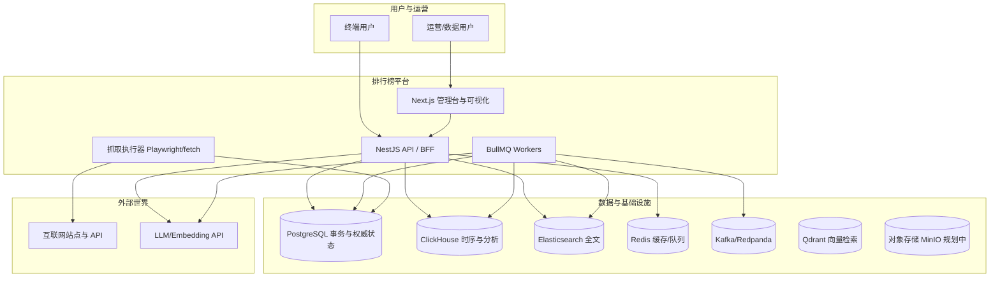
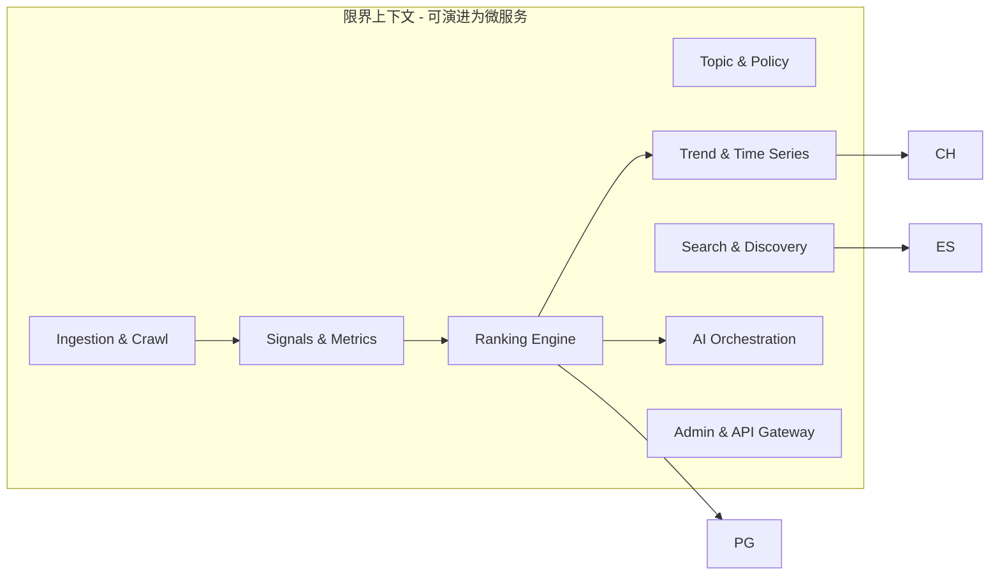
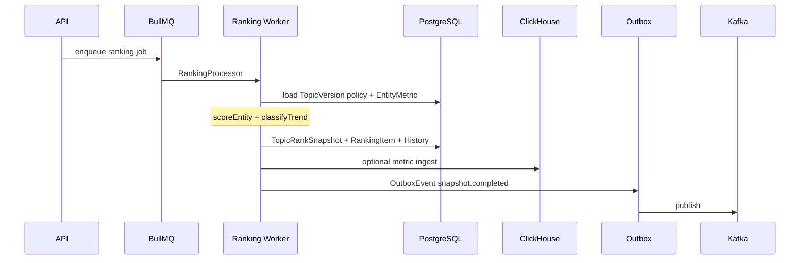

# AI 驱动全球动态排行榜与信息聚合平台 — 架构与差距说明

本文档将**产品愿景**与当前仓库 `ranking` 的实现**逐项对照**，并给出**目标架构、数据演化、算法落点与分阶段路线**。  
**约束**：当前代码库为**可运行的演示 / MVP 骨架**（NestJS + Prisma + Next.js），已覆盖「时间版本化快照 + 排行物化 + 异步任务 + 基础抓取 + 搜索骨架 + AI 简报」；**亿级规模、完整多 Agent、向量语义、全球分布式爬虫、K8s 全套**等需按下文路线演进。

---

## 1. 需求 ↔ 实现对照（摘要）

| 需求域 | 愿景要求 | 当前仓库状态 | 差距 / 下一步 |
|--------|----------|--------------|----------------|
| 三种排行（客观/半客观/主观趋势） | TopicKind 区分策略与展示 | **`TopicKind` 预设** + `mergePolicyWithTopicKind`；物化按 kind **必填信号/覆盖率**过滤；`GET /v1/topics/:slug` 返回 `kindStrategy`；**`GET /v1/topic-versions/:id/signal-preview`** 物化前覆盖率 | 外部信源按 kind 差异化权重仍待接 |
| 时间维度（日/周/月/年/实时/CUSTOM） | 多窗口排行与快照 | `TimeWindow` 枚举 + `TopicRanking` 唯一键 `(topicVersionId, timeWindow, windowStart)` | REALTIME 语义、滑动窗口、多 TZ 策略需产品化 |
| 不可变快照 + 版本 | 每次排行完整快照 | `TopicRankSnapshot`：`snapshotVersion`、`rankingJson`、`tTrendSummary`、`confidenceScore`、`generatedByAi` | 已满足核心模型；缺**自动 trendSummary 生成任务链** |
| 单条目排名演化 | previousRank、rankChange、趋势 | `RankingItem`：`previousRank`、`rankChange`、`TrendType`、多维度 score | 快照内已满足；**历史极值与末端连续升降步数**在 `GET /v1/entities/:id/rank-history` 的 `summary` 中计算；**按实体物化统计表**见 §5.1（未建） |
| 历史时间线 | `RankingItemHistory` + 分析 | **`GET /v1/entities/:id/rank-history`** + **`GET /v1/entities/:id/timeline`**（多话题叠加）；话题侧 snapshots / trend-analyses | CH↔PG 运营报表、实时推送 |
| 时间衰减 / 权重 | 指数/分段/可配置 | `scoring.ts` + **`EntityMetric` 全链路**：`POST /admin/entities/:id/metrics` 写入 → 物化 `scoreEntity`；可选 CH `metric_timeseries`（`SYNC_RANKING_TO_CLICKHOUSE`） | 自动从抓取页抽取结构化信号仍待接 |
| 趋势分析 | 环比/同比/MA/异常 | 物化写入 `TrendAnalysis` + **`GET /v1/topics/:slug/trend-analyses`**；**`GET /v1/trends/anomalies`** + 统一 Webhook 告警；BI `trends.alerts` | 同比回填 |
| 抓取：增量、断点、去重 | checkpoint、fingerprint | `CrawlCheckpoint`、`CrawledUrl`；**全球调度** + overview/Prometheus | 多区域 K8s 生产落地、调度 SLA 与配额 |
| 向量语义 / 亿级 ES | Qdrant/Milvus + ES | **Qdrant 主检索**（`SEARCH_PRIMARY`）+ ES **ILM/rollover** + 规模验证 API | 跨集群 DR、crawl 语义 ANN 全量 |
| Kafka 事件网 | 全链路事件 | **6 类外发 Kafka** + 1 类仅登记；**本仓库无 Consumer**；双轨 `publishedAt` / `kafkaPublishedAt` | 外部消费方按 `docs/kafka/CONSUMER_BOUNDARY.md` 订阅 |
| Schema Registry | 中心化契约 | Redpanda SR + `KAFKA_SCHEMA_REGISTRY_URL` REST 注册 | 消息仍为 JSON 封套（非 Avro wire） |
| 微服务拆分 | 多进程/多服务 | `PROCESS_ROLE` + `platform-worker` / `crawl-worker` + Helm 多 Deployment | 未拆独立仓库 |
| 多 AZ 运维 | K8s 生产 | **Helm** + **AWS 接线**（`values-aws-production.yaml`、External Secrets、DR CronJob）、`PRODUCTION_WIRING_REQUIRED`、`scripts/dr-readiness.sh` CI | 季度 DR 演练执行 |
| AI Agent 体系 | 多 Agent | **BullMQ `ai-agent`** + **`AgentRun`** + 7 类快照/生命周期 agent；`RANKING_FOLLOWUP_AGENT_PIPELINE` | Temporal / Kafka `ai.analysis.requested`；更细粒度配额 |
| 搜索与推荐 | 语义、时间、趋势检索 + 推荐 | **Qdrant/ES/PG** + **DSL/RRF hybrid** + `similar-entities` / `similar-topics` | 协同过滤、更大规模话题向量 |
| 生产可观测 | Outbox/爬虫/BI | `observability` + 统一 **`AlertWebhookRouterService`** + [ALERT_ONCALL_RUNBOOK.md](./docs/ops/ALERT_ONCALL_RUNBOOK.md) | 托管集群常态化压测 |
| 规模验证 | 压测与 ILM | `POST /admin/scale/validate`、ES ILM、Qdrant benchmark、CH MV + BI 钻取 | 托管集群常态化压测 |
| 微服务 | DDD+拆服务 | **单体 Nest** | 按限界上下文拆分为独立服务（可选） |
| K8s / HA / 冷热分离 | 生产级 | **Helm chart** + 管理台 `/ops` + DR readiness API | Operator/多集群联邦、冷热 CH 分层待建 |

---

## 2. 目标系统上下文（C4 Context）

---

## 3. 容器级架构（逻辑「微服务」映射）

当前为**单体**，下列边界可作为未来拆分模块或服务名：

---

## 4. DDD：限界上下文与聚合

| 上下文 | 聚合根 | 说明 |
|--------|--------|------|
| Topic | `Topic` / `TopicVersion` | 话题定义、版本生效区间、`policyJson` 策略 |
| Ranking Run | `TopicRanking` | 某时间窗口一次「排行运行」生命周期 `queued→running→completed|failed` |
| Snapshot | `TopicRankSnapshot` | **不可变**榜单次快照；对外权威读模型之一 |
| Ranking Item | `RankingItem` | 一名实体在某快照中的名次与得分维度 |
| Entity | `Entity` | 被排对象；`EntityMetric` 为时序观测；`EntityRelation` 图 |
| Ingestion | `Source` / `CrawlTask` / `CrawledUrl` | 数据源、任务、URL 级状态 |
| Analytics | `TrendAnalysis` / CH metric 表 | 聚合趋势、大盘 |
| AI | `AiAnalysis` | 依附快照的解释性产出 |
| Integration | `OutboxEvent` | 可靠投递到 Kafka 与异步索引 |

---

## 5. 数据库设计（与当前 Prisma 对齐）

以下表**已在** `prisma/schema.prisma` 中落地（命名对应关系）：

| 需求命名 | Prisma 模型 |
|----------|-------------|
| topics | `Topic` |
| topic_versions | `TopicVersion` |
| topic_rankings | `TopicRanking` |
| topic_rank_snapshots | `TopicRankSnapshot` |
| ranking_items | `RankingItem` |
| ranking_item_history | `RankingItemHistory` |
| entities | `Entity` |
| entity_metrics | `EntityMetric` |
| metric_timeseries | `MetricTimeSeriesRef`（指向 ClickHouse 表） |
| trend_analysis | `TrendAnalysis` |
| score_models | `ScoreModel` |
| score_breakdowns | `ScoreBreakdown` |
| sources | `Source` |
| crawl_tasks | `CrawlTask` |
| crawl_checkpoints | `CrawlCheckpoint` |
| crawled_urls | `CrawledUrl` |
| ai_analysis | `AiAnalysis` |
| entity_relations | `EntityRelation` |
| （事件） | `OutboxEvent` |

### 5.1 建议扩展（支撑愿景中「历史极值 / 连续升降 / Topic 指纹」）

已实现（`20260519150000_roadmap_entity_stats_fingerprint`）：

- **`EntityTopicStats`**：每次快照 `persistSnapshotTransaction` 后增量 upsert；`GET /v1/entities/:id/rank-history` 的 `summary` 优先读物化表（`materialized: true`）。
- **`TopicFingerprint`**：相似话题 embedding 时写入 SimHash（`recommendations` 路径）；支撑后续 Topic Merge Agent。
- **PG 原生分区**：对大表 `RankingItemHistory`、`CrawledUrl` 按 `generatedAt`/`fetchedAt` 月分区（Prisma 需 raw SQL migration）。
- **向量库**：独立存储 `embedding`、`entityId/urlId`、版本；检索走 VDB + ES hybrid。

### 5.2 ClickHouse

`metric_timeseries` + **90d TTL** + MV **`mv_metric_daily_topic`** → `metric_daily_topic`；`SYNC_RANKING_TO_CLICKHOUSE` + direct/outbox 写入；BI **`GET /admin/bi/drill/topic|entity`**；健康 **`GET /admin/bi/clickhouse/mv-health`**。

### 5.3 Elasticsearch

`ranking_entities`、`ranking_crawled_urls`；**写别名 + rollover + ILM 策略**（`ELASTICSEARCH_ILM_ENABLED`）；与 Qdrant **Outbox 双写**；规模 API 见 `docs/ops/SCALE_VALIDATION.md`。

---

## 6. 核心算法落点（真实代码）

| 能力 | 实现位置 | 说明 |
|------|----------|------|
| 时间衰减（指数 / 分段） | `src/domain/scoring.ts` `timeWeight` | 可配 `halfLifeDays` 或 breakpoints |
| 信源 tier → 信任 | `trustFromSourceTier` | S 型压缩 |
| 多信号混合得分 | `scoreEntity` | 产出 `breakdown` 对齐 `ScoreBreakdown` |
| EWMA / 斜率 / 波动 / 趋势分类 | `ewma` `leastSquaresSlope` `standardDev` `classifyTrend` | 输出应对齐 `TrendType` |
| AI 置信启发式 | `aiConfidence` | 可被 Agent 替换为模型打分 |

**已实现**：物化路径显式 `scoreEntity` + `ScoreModel` / `ScoreBreakdown`；`policyJson.decay` 与 `TopicKind` 预设合并（`mergePolicyWithTopicKind`）；follow-up 成功时写 `TopicRankSnapshot.trendSummary` / `generatedByAi`。

---

## 7. 排行与快照流水线（逻辑）

---

## 8. Kafka 消息流（生产者 + 外部队列）

**边界（必读）**：本仓库 **只生产、不消费** Kafka。进程内侧效应由 **Outbox Flusher / BullMQ** 完成，**不是** Kafka Consumer。详见 **`docs/kafka/CONSUMER_BOUNDARY.md`**。

**外发 Kafka**（`OutboxPublisherService`，`kafkaPublishedAt`；`publishToKafka: true`）：

| type | 默认 topic | 说明 |
|------|------------|------|
| `ranking.snapshot.completed` | `ranking.snapshot.completed` | 快照物化成功 |
| `crawl.url.fetched` | `crawl.url.fetched` | URL 落库 |
| `ai.agent.run.completed` | `ai.agent.run.completed` | Agent 运行结束 |
| `clickhouse.ranking.snapshot.ingest` | `clickhouse.ranking.snapshot.ingest` | CH 镜像（权威：Flusher） |
| `elasticsearch.entity.sync` | `elasticsearch.entity.sync` | ES 镜像（权威：Flusher） |
| `elasticsearch.crawled_url.sync` | `elasticsearch.crawled_url.sync` | ES 爬取镜像 |

Wire：**Envelope v1** + AJV（`src/kafka/schemas/`）；路由 **`src/kafka/event-registry.ts`**；目录 **`GET /admin/kafka/events`**。

**仅登记、默认不发 Kafka**：

- **`ranking.followup.requested`**（`publishToKafka: false`）：可选 Outbox 占位；执行由 **BullMQ `ranking-followup`** 负责。

**进程内 Flusher**（`publishedAt`，非 Kafka）：

- **ClickhouseOutboxFlusher**、**ElasticEntityOutboxFlusher**、**ElasticCrawledUrlOutboxFlusher**（与上表 ES/CH 类型对应，双轨时可同时有 `kafkaPublishedAt`）。

**目标**（演进）：更多领域事件注册 + 外部独立 consumer group（索引/风控/计费）；本仓库保持 producer 边界。

---

## 9. AI Agent 体系（目标拓扑 vs 现状）

| Agent | 职责 | 现状 |
|-------|------|------|
| Topic Discovery | 从新内容聚类发现可排话题 | **`topic-discovery-v1`**：`TopicProposal` + 管理台批准 |
| Ranking Agent | 权重推理、缺数据补全 | **`ranking-agent-v1`**：`EntityMetric` 覆盖率 → `AiAnalysis` |
| Trend Analysis Agent | 解读斜率/异常 | **`trend-analysis-v1`**：读 `TrendAnalysis.payload` + 可选 LLM |
| Fact Check | 冲突信源仲裁 | **`fact-check-v1`**：跨信源指标冲突 → `AiAnalysis` |
| Duplicate Detection | URL+内容+语义去重 | 抓取去重 + **`duplicate-detection-v1`** 报告 |
| Topic Merge | 同义话题合并 | **`topic-merge-v1`**：`TopicMergeAudit` + 迁移 `Source` |
| Time Series Agent | CH+PG 联合结论 | **`time-series-v1`**：`metric_timeseries` + 快照元数据 |
| Summary Agent | 榜单演化叙述 | **`post-snapshot-summary-v1`** / **`trend-v1`** / **`credibility-v1`** |
| Credibility Evaluation | 输出可信度 | **`credibility-v1`** + 快照 `confidenceScore`（启发式） |

**接线（2026-06）**：
- 物化后流水线：**`RANKING_FOLLOWUP_AGENT_PIPELINE`**（`AgentOrchestrationService` + `AgentRun`）
- 分析列表筛选：**`GET /v1/snapshots/:id/analyses?agentKind=`** 支持 `followup` / `trend` / `credibility` / `factcheck` / `trend_analysis` / `timeseries` / `ranking` / `default`
- 快照统计：**`includeAiStats=1`** 返回七类 **`has*Brief`**（与 `AI_ANALYSIS_BRIEF_SPECS` 一致）
- 配额：写入 **`AiAnalysis`** 的编排 agent 与 **`POST …/analyze`** 共用 **`AI_ANALYSIS_DAILY_CAP`**（`assertAnalysisQuota`）

**演进**：后续可迁 Temporal / Kafka `ai.analysis.requested`；按模型配额仍待办。

---

## 10. 搜索与推荐

**已有**：`SEARCH_PRIMARY=auto|qdrant|es|pg`；Qdrant/ES/PG 回退；**内联 DSL**（`type:` / `since:` / `topic:` / `source:` / `status:`）+ 显式 query 参数；**Hybrid RRF**（`hybrid=1` 融合全文+kNN，`SEARCH_RRF_K`）；Outbox 双写；**`GET /v1/recommendations/similar-*`**。

**缺口**：协同过滤推荐、更大规模话题向量。

---

## 11. 爬虫与「不重复」保证（工程化清单）

| 机制 | 现状 | 目标 |
|------|------|------|
| URL 规范化指纹 | `urlFingerprint` | 保持 |
| 内容哈希 | `contentHash` | 保持 |
| DOM 特征 | **`domFeaturesJson`**（meta/og/h1/canonical）；`CRAWL_DOM_FEATURES` | 结构化抽取扩展 |
| 反爬重试 | **`fetchCrawlWithRetry`** + `CRAWL_FETCH_MAX_RETRIES` + **`CRAWL_USER_AGENT_POOL`** | 验证码/人机挑战 |
| 同域链接跟进 | **`CRAWL_FOLLOW_LINKS`** BFS + **`CRAWL_FOLLOW_LINKS_MAX`** + **`CRAWL_FOLLOW_LINKS_MAX_DEPTH`** + **`CRAWL_LINK_ALLOW_HOSTS`** | 验证码/人机挑战 |
| robots.txt | **`CRAWL_RESPECT_ROBOTS`** + 任务内缓存 | 全站级 crawl-delay / sitemap |
| 断点 | `CrawlCheckpoint` | 多爬虫名并发分区 |
| 分布式 | **BullMQ**：多 API / 专用 `crawl-worker` 进程共用 Redis 队列；`CRAWL_WORKER_CONCURRENCY`、`CRAWL_JOB_LOCK_MS` | 队列分片名 + 调度审计 |
| 运营概览 | **`GET /admin/crawl/overview`**（与 **`ranking_crawl_*` Prometheus** 同源） | 抓取成功率 counter |
| 代理/IP | **`CRAWL_HTTP_PROXY`**、`Source.httpProxyUrl`（`fetch`+Playwright） | 代理池 + 出口国别策略、轮换 |
| 语义去重 | **`CRAWL_SEMANTIC_DEDUP`**：同信源 `previewEmbedding` 余弦、`fetched_semantic_dup` | 跨信源 / 大规模 ANN（ES/pgvector） |
| 幂等与续跑 | BullMQ jobId + DB 状态 | 与 Outbox 事务对齐 |

---

## 12. API 设计原则（面向愿景查询）

建议在现有 REST 基础上扩展（**尚未全部存在**）。**OpenAPI 3 片段**（`docs/openapi/`）：`admin-outbox.yaml`、`admin-entities.yaml`、**`admin-ops.yaml`**、**`entity-metrics.yaml`**、**`trends.yaml`**、**`v1-hot-boards.yaml`**、**`admin-observability.yaml`** 等；**`src/openapi/docs-openapi.spec.ts`**（**`npm test`**）做可解析性与关键 **`paths`** 断言。详情见 **`README`** Kafka/Outbox 与 OpenAPI 小节。

- `GET /v1/entities/:id/rank-history?topicSlug=&timeWindow=&limit=` — **`RankingItemHistory` 时间序列** + 历史最好/最差名次 + 末端连续升降步数（**已实现**）
- `GET /v1/topics/:slug/leaderboard?version=&timeWindow=&windowStart=&includeAiStats=` — **`{ resolved, snapshot }`**（**已实现**；**`resolved.hasScoreModel`**；嵌套 **`snapshot`** 与 **`GET /v1/snapshots/:id`** 同形）
- `GET /v1/topics/:slug/trend-analyses?limit=&timeWindow=` — **快照级 `TrendAnalysis` 列表**（**已实现**；管理台 **话题版本** 页展示摘要表）  
- `GET /v1/topics/:slug/snapshots?timeWindow=&limit=` — **`TopicRankSnapshot` 列表**（**已实现**；管理台 **话题版本** 页「近期快照」表；每条含 **`aiAnalysisCount`**、七类 **`has*Brief`**、**`hasScoreModel`**）  
- `PATCH /v1/topic-versions/:id/policy` — 更新 **`policyJson`**（**已实现**；`src/domain/policy-json.ts` 校验；**`frozen`** 不可改；管理台话题页 **policy** 编辑器）  
- `GET /v1/trends/hot?timeWindow=&limit=` — **快照级涨榜聚合**（**已实现（演示）**；由近期 `TrendAnalysis` 的 `topRankGainers` 汇总；C 端 **`/trends`**、管理台 **`/console/trends`**）  
- `GET /v1/hot-boards?timeWindow=&topicsLimit=&previewLimit=` — **C 端热榜索引**（**已实现**；有快照的话题及其最新榜 TOP 预览；C 端 **`/hot`**）  
- `POST /v1/snapshots/compare` — **已有**（多快照对比）；`snapshots[]` 含 **`hasScoreModel`**；`rows[].bySnapshot[id]` 含可选 **`scoreBreakdown`**  
- `GET /v1/snapshots/:id/score-breakdowns` — **`ScoreBreakdown` 关系表扁平导出**（**已实现**；`rows` 含 rank、实体、component、value、weight；旧快照无物化行时 `rowCount` 为 0）
- `GET /v1/snapshots/:id?includeAiStats=` — **快照 JSON**（含 **`items[].scoreBreakdown`**、**`scoreModel`** 及嵌套 **`topicRanking`**）+ 可选当前 `AiAnalysis` 计数与三类简报标记（**已实现**；`true`/`1` 时跳过快照 Redis 读且不回写缓存）  
- `GET /v1/snapshots/:id/analyses?agentKind=&agent=&limit=&offset=` — **`AiAnalysis` 列表**（**已实现**；分页 **`total` + `analyses`**，管理台 **`?analysisKind=`** 与 API **`agentKind`** 对齐）  
- `GET /v1/rankings/:topicRankingId/status` — **`TopicRanking` + 近期 `snapshots[]`**（**已实现**；每条快照含 **`hasScoreModel`**；非法 id **400**）  
- `GET /v1/recommendations/similar-topics?topicId=` — **已实现**：`TopicEmbedding` 余弦（见 README）  
- `GET /v1/recommendations/similar-entities?entityId=` — **已实现**：ES kNN（见 README 搜索/推荐）  

---

## 13. 前端（Next.js）

**C 端用户站点（根路径）**：`/` 首页、**`/hot` 多话题热榜索引**、`/topics/:slug` 单话题完整榜（日/周/月窗口）、`/entities/:id` 实体曲线与相似推荐、`/search`、`/trends` 涨榜、`/snapshots/:id` 只读快照；`SiteShell` 导航（首页 / 热榜 / 涨榜 / 搜索）；`site-api.ts` + 可选 `NEXT_PUBLIC_READ_API_KEY`。

**运营台（`/console`）**：原管理台全部页面；`AdminShell` 侧栏含「用户站点 ↗」链回 C 端。

**已有（运营台）**：多页、**`/console/bi` 大屏**、**`/console/scale`**、爬虫调度、Outbox、Agent 等；**话题版本** 页含 policy 编辑；**热榜 SSE** 等。

**缺口（产品级）**：

- 实体时间线 **深度分析**（**`GET /v1/entities/:id/timeline`** + 管理台 `/console/entities/timeline`）  
- **版本 diff**（**`POST /v1/topic-versions/compare`** + `/console/topics/version-diff`；AI 报告仍待接）  

---

## 14. 部署与运维

**开发**：`docker-compose.yml` — Postgres、Redis、Redpanda（Kafka）、ClickHouse、Elasticsearch、**Qdrant**、可选 Prometheus/Grafana。

**生产（规划）**：

- **K8s**：API、Web、Worker、HPA；Redis/托管；Kafka MSK/Confluent；RDS Postgres；CH Cloud；ES 托管。  
- **备份**：Postgres PITR；CH/ES 快照策略。  
- **灾备**：多 AZ + Outbox 重放 + 爬虫 checkpoint 可恢复。  

---

## 15. 分阶段路线图（建议）

### Phase A — 强化「时间演化」产品真相源（4–8 周级）

1. 快照生成后：**写入 `TrendAnalysis`**（✅ 已在 `RankingsService.persistSnapshotTransaction` 内写入快照级 `payload`）。  
2. 新 API：实体排行历史 + **极值/连续升降步数**（✅ `GET /v1/entities/:id/rank-history`；✅ **`EntityTopicStats` 物化**）。  
3. `TopicVersion.policyJson` **结构化**：权重、**decay**、**TopicKind 预设** 与 `scoreEntity` 对齐（✅ `parseRankingPolicyJson` + `mergePolicyWithTopicKind`）。  
4. **周期趋势**：✅ `TrendAnalysisSchedulerService` 每日 UTC `periodic_rollup`（`TREND_ANALYSIS_CRON_DISABLED` 可关）。  
5. **CH 报表**：✅ `GET /v1/analytics/snapshots/:id/metrics`（PG 元数据 + CH `metric_timeseries`）。

### Phase B — AI 编排

1. **编排骨架（已有）**：主排行物化成功后入队 **`ranking-followup`**（`post-snapshot`），与 `ranking` 队列解耦；Worker 内 **`RANKING_FOLLOWUP_ANALYZE_PIPELINE`**（逗号 DAG）或 **`RANKING_FOLLOWUP_ANALYZE*`** 布尔组合（见 `README` / `.env.example`）；可选 Outbox `ranking.followup.requested`。  
2. BullMQ DAG 深化：`ranking.completed` → `trend` → `summary` → `credibility`（逐步替换/串联 follow-up 内逻辑）。  
3. 多 **`AiAnalysis.agent` 名约定**（**已有**：`rules-v1`、`post-snapshot-summary-v1`；预留 `trend-v1`、`credibility-v1`）与 **detailJson.agentKind**；**`AI_ANALYSIS_DAILY_CAP`**（UTC 日）限制 **`AiAnalysis` 持久化**；**`AI_EMBEDDING_DAILY_CAP`** 限制当日 **成功** embedding **批次数**（一次 `embedMany` 计 1）；**`AI_EMBEDDING_AUDIT`** 控制 embedding 是否写入 **`AiAuditEvent`**（默认开启）。  
4. **运维只读**：**`GET /admin/ai/spectrum`**（当日配额、chat/embedding 审计计数、`recentSnapshotsWithAi`）；**`GET /admin/ai/audit-events`**（`limit`、`category`、`source`）；生产需网关鉴权。  
5. Prompt 模板与**进一步深化配额策略**（✅ 租户 `settingsJson.aiAnalysisDailyCap` 优先于全局 `AI_ANALYSIS_DAILY_CAP`；按模型等待办）。

### Phase C — 规模

1. PG 分区、只读副本、ES **ILM + rollover**（✅ `POST /admin/scale/elasticsearch/*`；`docs/ops/SCALE_VALIDATION.md`）。  
2. **Qdrant 主检索** + 语义去重 + 相似话题（✅ `SEARCH_PRIMARY`；✅ **`CRAWL_SEMANTIC_DEDUP_CROSS_SOURCE`**）。  
3. 爬虫全球调度 + 代理池（✅ **`CrawlSchedulerService`**；✅ **`CRAWL_PROXY_POOL`** / **`CRAWL_QUEUE_SHARD`**）。  
4. CH MV + BI 钻取 + 规模验证套件（✅ `metric_daily_topic`；✅ `POST /admin/scale/validate`）。  
5. **运维骨架**：✅ Helm；✅ 可观测 Grafana 预置看板。  

### Phase D — 商业化可靠性与合规

1. 鉴权、多租户、PII 分类（✅ `Tenant` / `ApiKey` / 全局 `ApiKeyGuard`；`Entity.piiLevel`；✅ **话题/榜单读路径租户过滤**；✅ **快照/实体 API PII 脱敏**）。  
2. 法务可解释性（✅ **`GET /admin/compliance/snapshots/:id/export`** JSON/CSV；`ComplianceAuditEvent`；既有 `score-breakdowns` + 物化 `ScoreModel` / `ScoreBreakdown`）。  

---

## 16. 结论

- **数据模型已与愿景高度同构**：时间窗口、快照不可变、条目升降、多维得分、历史表、抓取与 Outbox 骨架齐全。  
- **算法库已包含时间衰减与趋势分类**，但**与全量数据平面、Agent、向量与高并发运维尚未完全接线**。  
- 本文档可作为**长期演进的单一蓝图**；具体迭代请按 §15 分阶段落到 Issue / 里程碑。

维护：架构变更时请同步更新本文件、根目录 `README.md`，以及 `docs/kafka/CONSUMER_BOUNDARY.md` / `EVENT_CATALOG.md`。
