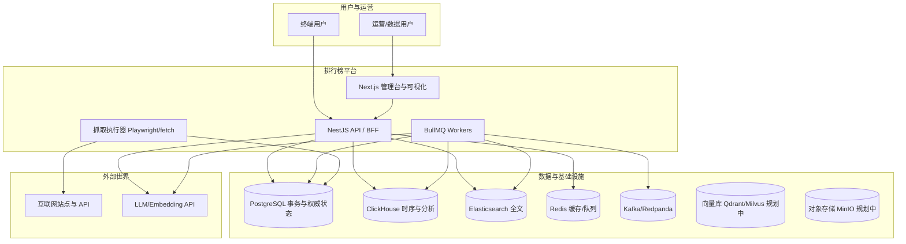
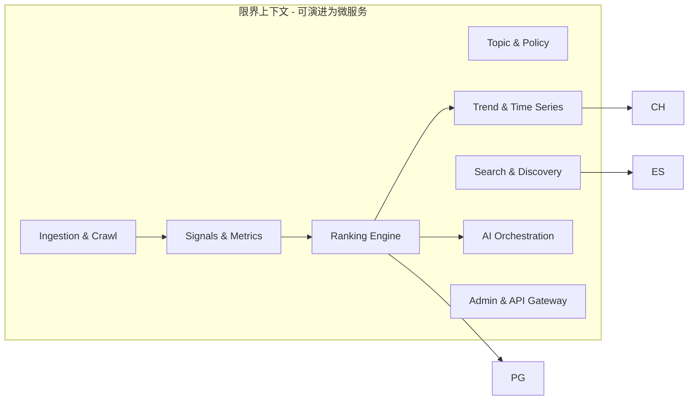
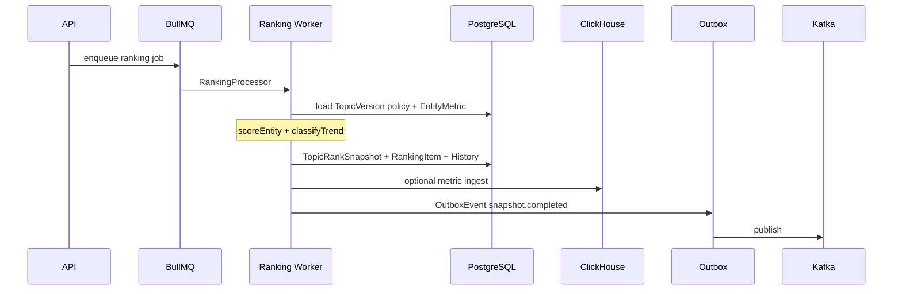

# AI 驱动全球动态排行榜与信息聚合平台 — 架构与差距说明

本文档将**产品愿景**与当前仓库 `ranking` 的实现**逐项对照**，并给出**目标架构、数据演化、算法落点与分阶段路线**。  
**约束**：当前代码库为**可运行的演示 / MVP 骨架**（NestJS + Prisma + Next.js），已覆盖「时间版本化快照 + 排行物化 + 异步任务 + 基础抓取 + 搜索骨架 + AI 简报」；**亿级规模、完整多 Agent、向量语义、全球分布式爬虫、K8s 全套**等需按下文路线演进。

---

## 1. 需求 ↔ 实现对照（摘要）

| 需求域 | 愿景要求 | 当前仓库状态 | 差距 / 下一步 |
|--------|----------|--------------|----------------|
| 三种排行（客观/半客观/主观趋势） | TopicKind 区分策略与展示 | `TopicKind`: `OBJECTIVE` / `SEMI_OBJECTIVE` / `SUBJECTIVE_TREND` | 管线需按 kind 切换**数据源与权重策略**；管理台展示差异化说明 |
| 时间维度（日/周/月/年/实时/CUSTOM） | 多窗口排行与快照 | `TimeWindow` 枚举 + `TopicRanking` 唯一键 `(topicVersionId, timeWindow, windowStart)` | REALTIME 语义、滑动窗口、多 TZ 策略需产品化 |
| 不可变快照 + 版本 | 每次排行完整快照 | `TopicRankSnapshot`：`snapshotVersion`、`rankingJson`、`tTrendSummary`、`confidenceScore`、`generatedByAi` | 已满足核心模型；缺**自动 trendSummary 生成任务链** |
| 单条目排名演化 | previousRank、rankChange、趋势 | `RankingItem`：`previousRank`、`rankChange`、`TrendType`、多维度 score | 快照内已满足；**历史极值与末端连续升降步数**在 `GET /v1/entities/:id/rank-history` 的 `summary` 中计算；**按实体物化统计表**见 §5.1（未建） |
| 历史时间线 | `RankingItemHistory` + 分析 | `RankingItemHistory` + **`GET /v1/entities/:id/rank-history`**；话题侧 **`GET /v1/topics/:slug/snapshots`** / **`trend-analyses`** | 缺 **CH↔PG 运营报表**、§13 曲线可视化与实时推送 |
| 时间衰减 / 权重 | 指数/分段/可配置 | `src/domain/scoring.ts`：`timeWeight`、`blendedObservation`、`scoreEntity` | 算法已有；**物化排行时未保证全链路使用该套权重**（需接 EntityMetric/外部信号） |
| 趋势分析 | 环比/同比/MA/异常 | 物化成功写入**快照级** `TrendAnalysis`（`entityId` 空）+ **`GET /v1/topics/:slug/trend-analyses`**；`scoring` 含 EWMA/斜率/波动分类 | 缺**独立周期作业**（回填/同比）、**异常阈值**与告警配置 |
| 抓取：增量、断点、去重 | checkpoint、fingerprint | `CrawlCheckpoint`、`CrawledUrl.urlFingerprint`、`contentHash`、`pageTitle`；BullMQ 异步任务 | **非分布式**；无代理池/全球调度；无 **AI 语义去重** |
| 向量语义 / 亿级 ES | Qdrant/Milvus + ES | ES 实体 + 爬取文档索引；无向量库 | 引入向量服务 + `embedding` 流水线 + 索引策略 |
| Kafka 事件网 | 全链路事件 | Outbox → Kafka（快照完成等）；多类型 Outbox flush | 非完整事件溯源；无 Schema Registry |
| AI Agent 体系 | 多 Agent | `POST /admin/snapshots/:id/analyze` + `AiAnalysis` | **单点分析**；缺 Topic Discovery / Merge / Dedup / FactCheck 等待办服务 |
| 搜索与推荐 | 语义、时间、趋势检索 + 推荐 | 统一搜索 PG+ES、管理台高亮 | 缺 **向量检索**、缺 **推荐与相似排行** API |
| 微服务 | DDD+拆服务 | **单体 Nest** | 按限界上下文拆分为独立服务（可选） |
| K8s / HA / 冷热分离 | 生产级 | `docker-compose` 开发栈 | 缺 Helm/Operator、备份与多 AZ 方案（文档级规划） |

---

## 2. 目标系统上下文（C4 Context）

---

## 3. 容器级架构（逻辑「微服务」映射）

当前为**单体**，下列边界可作为未来拆分模块或服务名：

---

## 4. DDD：限界上下文与聚合

| 上下文 | 聚合根 | 说明 |
|--------|--------|------|
| Topic | `Topic` / `TopicVersion` | 话题定义、版本生效区间、`policyJson` 策略 |
| Ranking Run | `TopicRanking` | 某时间窗口一次「排行运行」生命周期 `queued→running→completed|failed` |
| Snapshot | `TopicRankSnapshot` | **不可变**榜单次快照；对外权威读模型之一 |
| Ranking Item | `RankingItem` | 一名实体在某快照中的名次与得分维度 |
| Entity | `Entity` | 被排对象；`EntityMetric` 为时序观测；`EntityRelation` 图 |
| Ingestion | `Source` / `CrawlTask` / `CrawledUrl` | 数据源、任务、URL 级状态 |
| Analytics | `TrendAnalysis` / CH metric 表 | 聚合趋势、大盘 |
| AI | `AiAnalysis` | 依附快照的解释性产出 |
| Integration | `OutboxEvent` | 可靠投递到 Kafka 与异步索引 |

---

## 5. 数据库设计（与当前 Prisma 对齐）

以下表**已在** `prisma/schema.prisma` 中落地（命名对应关系）：

| 需求命名 | Prisma 模型 |
|----------|-------------|
| topics | `Topic` |
| topic_versions | `TopicVersion` |
| topic_rankings | `TopicRanking` |
| topic_rank_snapshots | `TopicRankSnapshot` |
| ranking_items | `RankingItem` |
| ranking_item_history | `RankingItemHistory` |
| entities | `Entity` |
| entity_metrics | `EntityMetric` |
| metric_timeseries | `MetricTimeSeriesRef`（指向 ClickHouse 表） |
| trend_analysis | `TrendAnalysis` |
| score_models | `ScoreModel` |
| score_breakdowns | `ScoreBreakdown` |
| sources | `Source` |
| crawl_tasks | `CrawlTask` |
| crawl_checkpoints | `CrawlCheckpoint` |
| crawled_urls | `CrawledUrl` |
| ai_analysis | `AiAnalysis` |
| entity_relations | `EntityRelation` |
| （事件） | `OutboxEvent` |

### 5.1 建议扩展（支撑愿景中「历史极值 / 连续升降 / Topic 指纹」）

可在后续迁移中增加（**尚未实现**）：

- **`EntityTopicStats`**（或物化视图）：`entityId`, `topicId`, `timeWindow`, `bestRank`, `worstRank`, `currentStreakUp`, `currentStreakDown`, `lastUpdatedAt` — 由 Worker 在每次快照后增量更新。
- **`TopicFingerprint` / `ContentFingerprint`**：语义向量 hash 或 SimHash，支撑「Topic 去重 / 合并」。
- **PG 原生分区**：对大表 `RankingItemHistory`、`CrawledUrl` 按 `generatedAt`/`fetchedAt` 月分区（Prisma 需 raw SQL migration）。
- **向量库**：独立存储 `embedding`、`entityId/urlId`、版本；检索走 VDB + ES hybrid。

### 5.2 ClickHouse

当前仓库含 `metric_timeseries` 与同步路径（见 `README`）。生产需：**TTL、分区键、物化视图** 预聚合「按天/按实体」指标。

### 5.3 Elasticsearch

已有 `ranking_entities`、`ranking_crawled_urls`。扩展方向：为「话题+时间窗口」建只读索引副本，满足「2023 最火歌手」类查询。

---

## 6. 核心算法落点（真实代码）

| 能力 | 实现位置 | 说明 |
|------|----------|------|
| 时间衰减（指数 / 分段） | `src/domain/scoring.ts` `timeWeight` | 可配 `halfLifeDays` 或 breakpoints |
| 信源 tier → 信任 | `trustFromSourceTier` | S 型压缩 |
| 多信号混合得分 | `scoreEntity` | 产出 `breakdown` 对齐 `ScoreBreakdown` |
| EWMA / 斜率 / 波动 / 趋势分类 | `ewma` `leastSquaresSlope` `standardDev` `classifyTrend` | 输出应对齐 `TrendType` |
| AI 置信启发式 | `aiConfidence` | 可被 Agent 替换为模型打分 |

**待办**：将 `RankingProcessor`（或其它物化服务）中原始分→**显式调用** `scoreEntity` + 持久化 `ScoreModel` / `ScoreBreakdown`，并把 `TopicVersion.policyJson` 解析为权重与 decay 配置。

---

## 7. 排行与快照流水线（逻辑）

---

## 8. Kafka 消息流（当前 + 目标）

**当前**：`OutboxPublisherService` 发布 `ranking.snapshot.completed`；其它 Outbox 类型由进程内 Flusher 消费（ClickHouse/ES），**不全部经 Kafka**。

**目标**（演进）：

- `crawl.url.fetched`、`entity.signal.updated`、`ranking.requested`、`ranking.completed`、`ai.analysis.requested` 等主题；
- **Schema Registry**（Protobuf/JSON Schema）；
- **消费者组** 分离：索引、风控、计费、对账。

---

## 9. AI Agent 体系（目标拓扑 vs 现状）

| Agent | 职责 | 现状 |
|-------|------|------|
| Topic Discovery | 从新内容聚类发现可排话题 | 无 |
| Ranking Agent | 权重推理、缺数据补全 | 部分在 `scoreEntity`/人工 policy |
| Trend Analysis Agent | 解读斜率/异常 | 算法有，LLM 未接 |
| Fact Check | 冲突信源仲裁 | 无 |
| Duplicate Detection | URL+内容+语义去重 | URL/哈希级有 |
| Topic Merge | 同义话题合并 | 无 |
| Time Series Agent | CH+PG 联合结论 | 无 |
| Summary Agent | 榜单演化叙述 | **部分**：`AiAnalysis` 存快照级摘要 |
| Credibility Evaluation | 输出可信度 | `confidenceScore` 字段有，**自动化弱** |

**演进**：用 **BullMQ 编排**「DAG 任务」或以 **Temporal** 等工作流引擎；每条任务写 `AiAnalysis` 或独立 `AgentRun` 表（待建模）。

---

## 10. 搜索与推荐

**已有**：`GET /v1/search` 聚合实体+爬取；ES/ PG 双路径；管理台高亮。

**缺口**：

- **时间检索**：`windowStart`/`snapshotTime` 范围 DSL；
- **语义 / 向量**：引入 embedding 与 hybrid search；
- **推荐**：`TopicRanking` 协同、「相似实体」走 `EntityRelation` + 向量近邻。

---

## 11. 爬虫与「不重复」保证（工程化清单）

| 机制 | 现状 | 目标 |
|------|------|------|
| URL 规范化指纹 | `urlFingerprint` | 保持 |
| 内容哈希 | `contentHash` | 保持 |
| 断点 | `CrawlCheckpoint` | 多爬虫名并发分区 |
| 分布式 | 单机 Worker | **分片队列** + 租约 |
| 代理/IP | 无 | 代理池 + 出口国别策略 |
| 语义去重 | 无 | embedding 聚类 |
| 幂等与续跑 | BullMQ jobId + DB 状态 | 与 Outbox 事务对齐 |

---

## 12. API 设计原则（面向愿景查询）

建议在现有 REST 基础上扩展（**尚未全部存在**）：

- `GET /v1/entities/:id/rank-history?topicSlug=&timeWindow=&limit=` — **`RankingItemHistory` 时间序列** + 历史最好/最差名次 + 末端连续升降步数（**已实现**）  
- `GET /v1/topics/:slug/trend-analyses?limit=&timeWindow=` — **快照级 `TrendAnalysis` 列表**（**已实现**；管理台 **话题版本** 页展示摘要表）  
- `GET /v1/topics/:slug/snapshots?timeWindow=&limit=` — **`TopicRankSnapshot` 列表**（**已实现**；管理台 **话题版本** 页「近期快照」表；每条含 **`aiAnalysisCount`**、**`hasFollowupBrief`**、**`hasTrendBrief`**、**`hasCredibilityBrief`**）  
- `PATCH /v1/topic-versions/:id/policy` — 更新 **`policyJson`**（**已实现**；`src/domain/policy-json.ts` 校验；**`frozen`** 不可改；管理台话题页 **policy** 编辑器）  
- `GET /v1/trends/hot?timeWindow=&limit=` — **快照级涨榜聚合**（**已实现（演示）**；由近期 `TrendAnalysis` 的 `topRankGainers` 汇总；管理台 **`/trends`**）  
- `POST /v1/snapshots/compare` — **已有**（多快照对比）  
- `GET /v1/snapshots/:id?includeAiStats=` — **快照 JSON + 当前 `AiAnalysis` 计数与三类简报标记**（**已实现**；`true`/`1` 时跳过快照 Redis 读且不回写缓存）  
- `GET /v1/snapshots/:id/analyses?agentKind=&agent=&limit=&offset=` — **`AiAnalysis` 列表**（**已实现**；分页 **`total` + `analyses`**，管理台 **`?analysisKind=`** 与 API **`agentKind`** 对齐）  
- `GET /v1/recommendations/similar-topics?topicId=` — 推荐占位  

---

## 13. 前端（Next.js）

**已有**：管理台多页、ECharts、快照对比、搜索、爬取、Outbox、ES 健康等；**话题版本** 页含 **`TrendAnalysis` 快照摘要**、**近期快照**、**policyJson 编辑（PATCH）**；**实体** 页 **rank-history** JSON + **`/entities/rank-history`** 折线图；**`/trends`** 热点表（`GET /v1/trends/hot`）。**快照详情** `/snapshots/:id` 支持 **`?analysisKind=`** / **`?analysisPage=`** / **`?analysisLimit=`**，与 **`GET /v1/snapshots/:id/analyses`** 分页对齐。

**缺口（产品级）**：

- 实体时间线 **深度分析**（多话题叠加对比、事件标注、分享视图）  
- **版本 diff** 报告（AI 生成 + 人机审）  
- REALTIME 榜的 **SSE/WebSocket** 刷新  

---

## 14. 部署与运维

**开发**：`docker-compose.yml` — Postgres、Redis、Redpanda、ClickHouse、Elasticsearch。

**生产（规划）**：

- **K8s**：API、Web、Worker、HPA；Redis/托管；Kafka MSK/Confluent；RDS Postgres；CH Cloud；ES 托管。  
- **备份**：Postgres PITR；CH/ES 快照策略。  
- **灾备**：多 AZ + Outbox 重放 + 爬虫 checkpoint 可恢复。  

---

## 15. 分阶段路线图（建议）

### Phase A — 强化「时间演化」产品真相源（4–8 周级）

1. 快照生成后：**写入 `TrendAnalysis`**（✅ 已在 `RankingsService.persistSnapshotTransaction` 内写入快照级 `payload`）。  
2. 新 API：实体排行历史 + **极值/连续升降步数**（✅ `GET /v1/entities/:id/rank-history`）。  
3. `TopicVersion.policyJson` **结构化**：权重、decay、信源 tier 与 `scoreEntity` 对齐（**部分已有**：物化路径使用 `policy.weights` + `scoreEntity`；**管理台可 PATCH** `policyJson`（`src/domain/policy-json.ts` 校验）；可再加强校验与字段级表单）。

### Phase B — AI 编排

1. **编排骨架（已有）**：主排行物化成功后入队 **`ranking-followup`**（`post-snapshot`），与 `ranking` 队列解耦；Worker 内 **`RANKING_FOLLOWUP_ANALYZE_PIPELINE`**（逗号 DAG）或 **`RANKING_FOLLOWUP_ANALYZE*`** 布尔组合（见 `README` / `.env.example`）；可选 Outbox `ranking.followup.requested`。  
2. BullMQ DAG 深化：`ranking.completed` → `trend` → `summary` → `credibility`（逐步替换/串联 follow-up 内逻辑）。  
3. 多 **`AiAnalysis.agent` 名约定**（**已有**：`rules-v1`、`post-snapshot-summary-v1`；预留 `trend-v1`、`credibility-v1`）与 **detailJson.agentKind**；**`AI_ANALYSIS_DAILY_CAP`** 为全局软配额占位。  
4. Prompt 模板与**配额/审计**（生产必须）。

### Phase C — 规模

1. PG 分区、只读副本、ES 索引滚动。  
2. 向量库 + 语义去重 + 相似话题。  
3. 爬虫分布式与代理池。  

### Phase D — 商业化可靠性与合规

1. 鉴权、多租户、PII 分类。  
2. 法务可解释性：**ScoreBreakdown** 导出与审计日志。  

---

## 16. 结论

- **数据模型已与愿景高度同构**：时间窗口、快照不可变、条目升降、多维得分、历史表、抓取与 Outbox 骨架齐全。  
- **算法库已包含时间衰减与趋势分类**，但**与全量数据平面、Agent、向量与高并发运维尚未完全接线**。  
- 本文档可作为**长期演进的单一蓝图**；具体迭代请按 §15 分阶段落到 Issue / 里程碑。

维护：架构变更时请同步更新本文件与根目录 `README.md` 的「Priority」段落。
