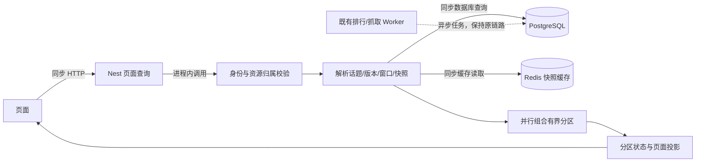
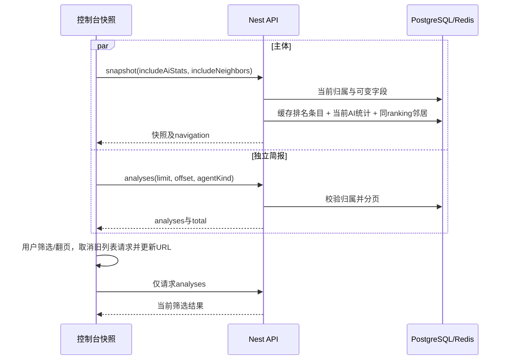

# ranking 请求聚合层改造说明

日期：2026-09-06。代码已写入 `/Users/guoyuququan/projects/ranking`，基于 `0e28f77`，未提交、未部署。实施范围沿用《请求聚合层整体规划》：按页面所需资源与刷新周期组织读取，保留具有独立加载、分页或故障边界的请求。

## 1. 已实施的请求划分

下表中的次数指业务 API 读取，不包含静态资源、Next.js 路由预取、SSE 和写请求；静态路径对比不等同于生产延迟测量。

| 页面/模块 | 改造结果 | 关键入口 |
|---|---|---|
| C 端首页 | 去掉重复话题标题请求；保留趋势与排行榜两个并行读取 | `web/src/app/(site)/page.tsx` |
| C 端话题详情 | 话题、当前排行榜、最近快照从 3 次变为 1 次 overview；共享版本/窗口解析 | `src/rankings/queries/topic-overview.query.ts` |
| C 端实体详情 | 主体统一由 timeline 提供名称、话题、40 点曲线、统计与事件；推荐在独立 Suspense 区域加载 | `src/rankings/ops-analytics.service.ts` |
| 控制台快照详情 | 快照携带相邻导航，取消后续 ranking status 读取；首屏保留快照、简报两个并行请求 | `src/rankings/queries/snapshot-context.query.ts` |
| 快照简报 | 筛选、每页数量、分页、浏览器后退只刷新 analyses，取消旧请求并保护结果顺序；保留可分享 URL | `web/src/components/snapshot-analyses-panel.tsx` |
| C 端快照 | 主体与独立简报保持并行；去掉未使用的 AI 统计参数 | `web/src/app/(site)/snapshots/[id]/page.tsx` |
| 抓取监控 | 当前信源 URL/任务/可选 watchedTask 合为 monitor；sources 与全局 overview 仍独立并行、低频刷新 | `src/ingestion/queries/crawl-monitor.query.ts` |
| 控制台首页 | 6 个健康读取改为 1 个 health-summary；原部署探针接口保持 | `src/ops/queries/health-summary.query.ts` |
| Agent 控制台 | 初始 3 个资源并行；入队只刷新 runs，审批/拒绝只刷新 proposals，各资源独立取消 | `web/src/app/console/agents/page.tsx` |
| 搜索 | 沿用统一搜索 API；取消旧请求，忽略过期响应 | 两个 search 页面 |
| 热榜 | 从逐话题读取完整榜单，改为批量关系投影，只选择 Top-N 预览和总条数；保留原接口 | `RankingsService.listHotBoards` |
| BI 大屏 | PG 核心指标保持必需；健康共享采样，CH/运维/趋势并发读取并独立缓存与降级 | `src/bi/bi.service.ts` |
| 其他独立功能 | 偏好、推荐、钻取、写操作和单资源页面保留原有独立边界 | 原 API 与页面 |

没有引入浏览器任意传入 URL 的通用批量接口，也没有新增 BFF 进程；聚合在现有 NestJS 内完成，直接复用服务和 Prisma，不通过本机 HTTP 回调旧 API。

## 2. 新增和扩展的接口

| 接口 | 输入与返回重点 | 权限与失败语义 |
|---|---|---|
| `GET /v1/topics/:slug/overview` | version/timeWindow/windowStart/includeAiStats/recentLimit；返回 topic、selection、leaderboard、recentSnapshots、meta | 先按租户解析话题，再读关联快照；不存在 404；分区读失败为 unavailable |
| `GET /v1/snapshots/:id?includeNeighbors=true` | 原快照字段加 navigation；previous/next 只在同 ranking 内按时间、ID 定位 | 在读取缓存或相邻条目前校验当前归属；边界邻居为 null |
| `GET /admin/crawl/monitor` | sourceId、watchTaskId；URL 默认 20/上限 50，任务默认 12/上限 30 | admin；显式资源不可见返回 404；watchedTask 单独校验租户，列表内已有则复用 |
| `GET /admin/ops/health-summary` | API/PG/Redis/Kafka/ES/CH 采样，带 configured/status/checkedAt/latencyMs | admin；服务状态区分 healthy/unhealthy/unconfigured/timeout；不改变探针状态码 |

分区契约：`status=ok|empty|unavailable`，失败时 `data=null` 并给出安全错误码；不会把权限错误转成 HTTP 200 的部分成功。topic/monitor 附带 schemaVersion、requestId、generatedAt 和 partial。BI 可选块使用 `ok|stale|unavailable`，保留旧数据时标明采样时间。

契约文件：项目内 `docs/openapi/page-queries.yaml`；时间线补充说明在 `docs/openapi/ops-analytics.yaml`。

## 3. 调用流程



本次新增的聚合读取不经过 MQ。原 BullMQ/Kafka 写入、后台计算和通知链路保持原职责。



## 4. 核心实现提炼

### 话题与快照

```text
resolveTopicRanking(slug, selection, auth):
  校验 windowStart/timeWindow 组合
  获取当前租户可见话题
  选择指定版本或最新版本
  定位对应窗口、具有快照的 ranking 和最新 snapshot
  返回统一上下文

overview:
  context = resolveTopicRanking(...)
  并行读取：授权快照投影、相同版本/窗口的最近快照
  组合公共话题信息、selection、各分区状态

snapshot:
  先读当前归属并授权
  排名内容读 v3 Redis 缓存，未命中才查完整快照
  缓存写入发生在调用方脱敏之前
  按需附加当前 AI 统计，不把计数写进排名缓存
  覆盖当前 confidenceScore/trendSummary/generatedByAi
  按调用方 scope 脱敏响应
```

### 时间线与热榜

时间线先校验实体和显式话题，再用有上限的聚合 SQL 选出话题；一条 LATERAL 查询按每个话题获取最近 N 个点，与实体统计及指标读取并行。历史与时间线复用 `rankingHistorySummary`，用 `summaryScope` 区分全历史物化统计与当前返回点统计。

热榜保留筛选与候选分页，关系投影限制版本、ranking、快照和预览条目，避免应用层逐话题完整榜单读取。`itemCount` 为实际总条数；nextOffset 按已经扫描的候选推进，跳过空榜后不重复返回前页话题。仍保留 PII 脱敏和 REALTIME 元数据。

**不能把一次 Prisma 关系读取宣称为一条 SQL。** Prisma 的实际 SQL 数和内部 Top-N 执行成本仍需要在真实数据库上采样与 EXPLAIN。

### 轮询与缓存

```text
一个资源拥有一个轮询器：
  当前请求未结束时，刷新请求合并为一次待执行刷新
  请求结束后再安排下次，不使用固定间隔制造重叠
  页面隐藏或组件卸载 -> abort + 清理计时器
  页面恢复 -> 刷新
  错误 -> 指数退避；成功 -> 恢复正常周期
  资源选择变化 -> 取消旧请求，拒绝旧结果覆盖新选择
```

| 资源 | 策略 |
|---|---|
| monitor | 活跃/快速模式 3 秒，平稳模式 10 秒；切换信源清理旧列表 |
| crawl overview | 20 秒刷新，共享后端 10 秒采样缓存 |
| sources | 60 秒刷新，创建抓取任务不重新拉配置 |
| BI overview | 30 秒刷新，错误退避、页面隐藏暂停 |
| health-summary | 进程内共享 5 秒采样；每服务等待预算 800ms |
| BI 可选块 | CH 60 秒、运维摘要 15 秒、趋势扫描 30 秒；等待预算 1500ms；失败可返回带时间的 stale |
| 快照 | 缓存前缀升至 v3，继续使用既有 TTL 配置；不缓存调用方脱敏版本，不缓存 AI 计数 |

健康和 BI 的响应超时**不会取消底层 SDK 操作**；进行中标记保留到操作真正结束，防止超时后的请求重复启动慢依赖。上述采样缓存是进程内的，不是跨实例协调。BI/全局 crawl overview 继续采用既有平台管理员视图；不能将这类缓存直接复用于租户私有接口。

## 5. 验证结果

- 改造前基线：64 个测试文件、162 项通过。
- 最终回归：72 个测试文件、190 项通过。
- 后端 Nest build、前端 Next.js 生产 build（含类型检查）通过。
- 前后端 `eslint src` 和 `git diff --check` 通过。
- 本机 Nest HTTP 冒烟：新路由、管理员 scope、租户上下文传递、非法 ID/上限、快照导航通过；确认 `includeNeighbors=false` 不会被隐式转换成 true。
- 生产构建配合本机模拟 API 的 Chrome 验证：快照首屏后执行筛选、翻页、后退，快照 API 总计仍为 **1 次**，analyses 总计 **4 次**；话题 overview **1 次**，未读取旧话题/leaderboard；实体 timeline **1 次**、独立推荐 **1 次**。
- 浏览器补测：BI 运维摘要不可用时主体仍显示；空信源监控首屏 monitor、overview、sources 各 1 次，未出现浏览器异常。BI 时钟已改为客户端挂载后显示，消除预渲染时间差导致的水合错误。
- 测试覆盖跨租户缓存访问、先缓存后脱敏、AI 计数变化、watchedTask 复用与局部失败、空信源、限额、轮询取消/不重叠/退避、缓存过期与超时后的请求合并。

测试没有连接真实业务数据库或中间件。没有测量生产 p50/p95、SQL 扫描行数、连接池等待、响应字节数，也没有进行真实多实例压测，因此这里只确认实现和受控环境行为，不宣称生产性能指标已经达标。

## 6. 发布与后续验证

1. 先发布兼容旧客户端的后端，再发布依赖新接口的前端；此次无需 schema migration。
2. 新旧快照缓存前缀可自然共存，旧条目按原 TTL 到期，不需要全量清空 Redis。
3. 在预发布环境记录首屏、筛选、分页及 60 秒空闲期间的浏览器→API与 SSR→API 请求；另行记录 SQL、返回体积和 p50/p95。
4. 验证真实租户权限、读副本延迟、CH 断连/超时、多实例健康采样和持续运行的轮询；据数据调整当前保守刷新周期与预算。
5. 如需回滚，先回退前端，再回退后端，避免旧后端缺少新聚合路径。

原始分析与规划文档仍保留，本文记录本次实际落地范围和验证边界。
